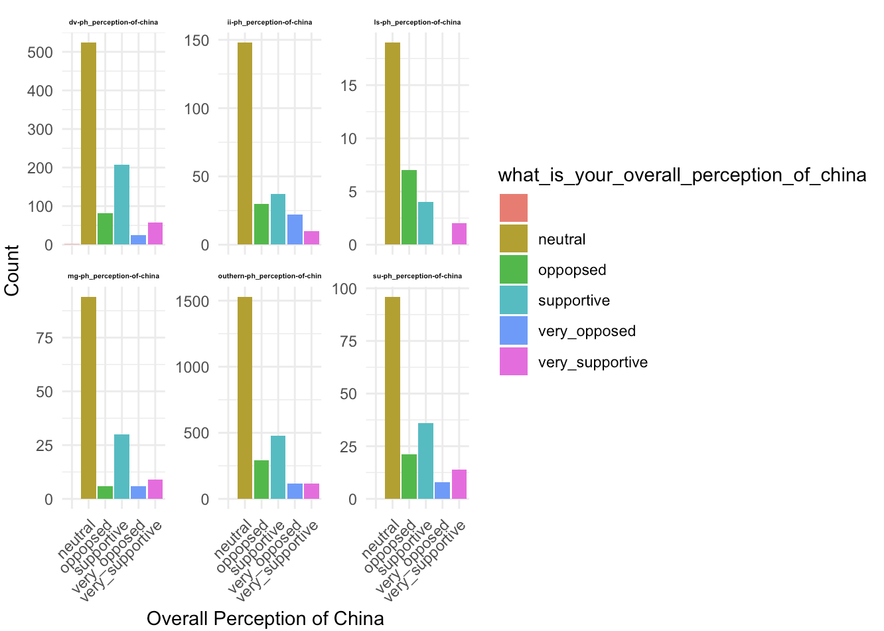
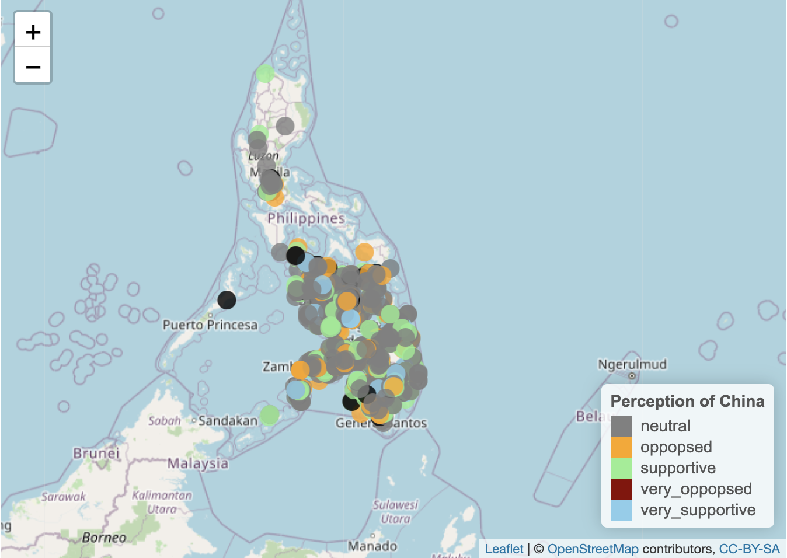
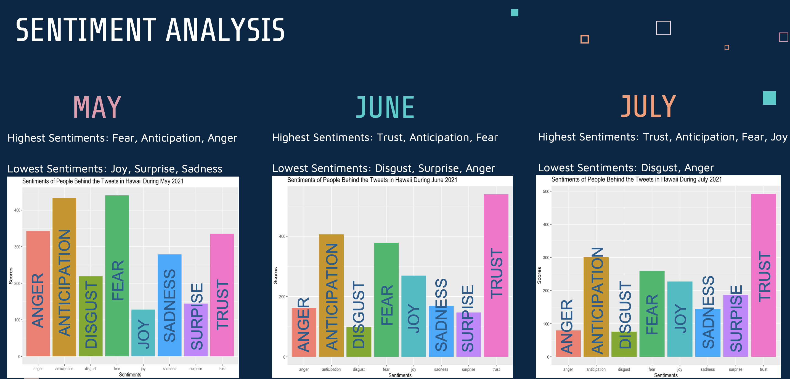
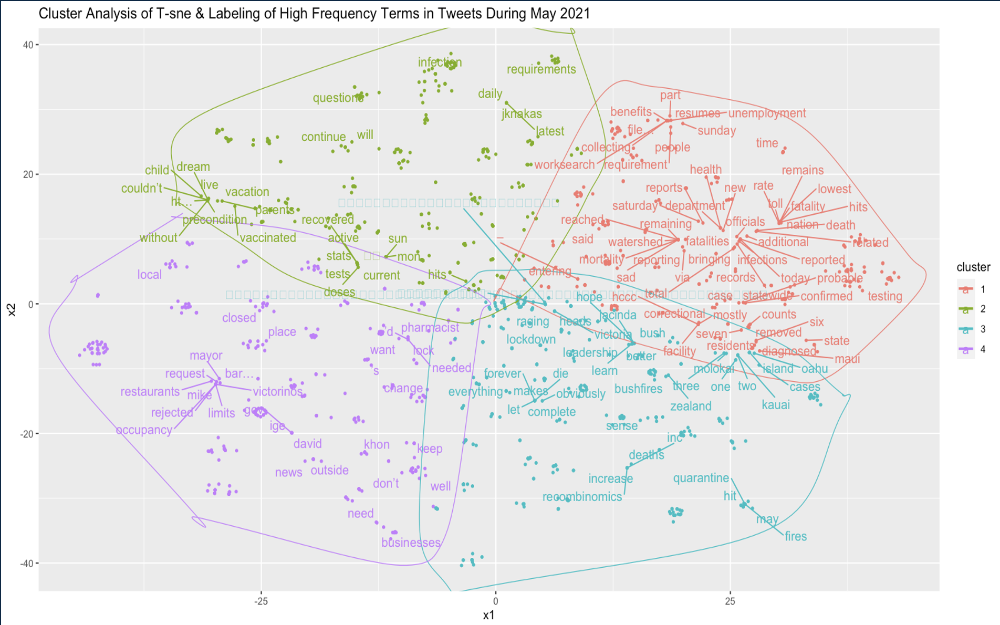

# Armando - Luna
Data Science Portfolio

# [Project 1: Perception Of China In The Phillipines](https://github.com/the-lunaverse/Survey_Analysis/blob/main/Perception%20of%20China.Rmd) 

* Conducted Ad-Hoc Analysis of survey data in the Phillipines to build insight of the social climate towards China.
* Investigated over 1,500 particpants survey responses using R and plotly. 
* Transformed categorical data into numerical data to measure and quantify the responses. 
* Utilized Leaflet for geospatial data visualization to create a compelling data-driven story.

## Survey Responses of All 6 Survey Campaigns 

## Geospatial Visualization Using Leaflet

# [Project 2:  Sentiments in Hawaii During The Covid-19 Pandemic](https://github.com/the-lunaverse/NLP/blob/main/NLP_Twitter_Analysis.R) 

* Examined the sentiments behind social media Tweets during the height of the Pandemic.
* Scraped approximately 2,000 tweets using the PAI Twitter API. 
* Transformed unstructured data tweets into structured data using excel. 
* Applied Natural Language Processing Techniques (NLP) & unsupervised machine learning techniques, specifically t-SNE (t-distributed stochastic neighbor embedding) and CLARA (Clustering Large Applications) algorithms, to group similar words and analyze tweet content.

## Sentiment Scores of Tweets in May, June, & July 2021 

## t-SNE and Clara Cluster Analysis

