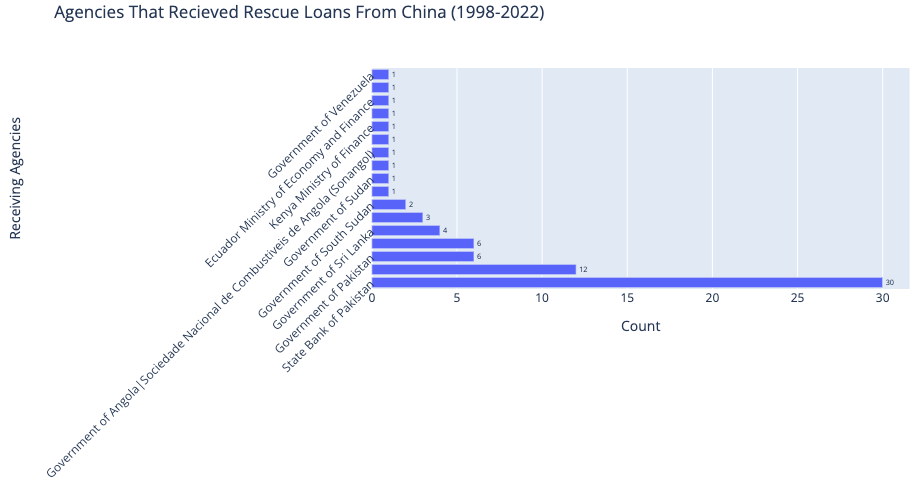

# Armando - Luna
Data Science Portfolio

# [Project 1: Perception Of China In The Philipines](https://github.com/the-lunaverse/Survey_Analysis/blob/main/Perception%20of%20China.Rmd) 

* Conducted Ad-Hoc Analysis of survey data in the Philippines to build insight of the social climate towards China.
* Investigated over 1,500 participants survey responses using R and plotly. 
* Transformed categorical data into numerical data to measure and quantify the responses. 
* Utilized Leaflet for geospatial data visualization to create a compelling data-driven story.

## Survey Responses of All 6 Survey Campaigns 

## Geospatial Visualization Using Leaflet

# [Project 2: Exploring The Peoples Bank of China Rescue Loans to Foreign Nations (EDA)](https://github.com/the-lunaverse/PBOC-Rescue-Loans-Analysis) 

* Conducted in-depth analysis of People's Bank of China (PBOC) Rescue Loans dataset, extracting valuable insights into China's financial influence on low- and middle-income countries.
* Skillfully utilized Python, pandas, and Plotly to perform exploratory data analysis, data visualization, and to create choropleth maps and bar charts for better data comprehension.
* Identified top recipient countries and organizations of Chinese rescue loans, highlighting potential areas of financial influence and future policy implications.
* Presented a comprehensive summary of findings, effectively communicating data-driven insights and showcasing proficiency in both data analysis and visualization techniques.

## Countries That Received "Rescue Loans" From China (1998-2022) 

## Organizations That Received "Rescue Loans" From China (1998-2022)

# [Project 3:  Sentiments in Hawaii During The Covid-19 Pandemic](https://github.com/the-lunaverse/NLP/blob/main/NLP_Twitter_Analysis.R) 

* Examined the sentiments behind social media Tweets during the height of the Pandemic.
* Scraped approximately 2,000 tweets using the PAI Twitter API. 
* Transformed unstructured data tweets into structured data using R and Excel. 
* Applied Natural Language Processing Techniques (NLP) & unsupervised machine learning techniques, specifically t-SNE (t-distributed stochastic neighbor embedding) and CLARA (Clustering Large Applications) algorithms, to group similar words and analyze tweet content.

## Sentiment Scores of Tweets in May, June, & July 2021 

## t-SNE and Clara Cluster Analysis

# [Project 4: Machine Learning Prediction of Bioeffects in Novel Nanomaterials (Random Forest) ](https://github.com/NSF-ALL-SPICE-Alliance/AFRL/blob/main/random_forest_split_data.Rmd) 

* Developed and implemented preprocessing techniques in R to clean and prepare a transcriptomics dataset, resulting in the removal of missing values and conversion of response columns to factor data types for optimal model training.
* Utilized the Random Forest algorithm to create six distinct predictive models for cellular outcomes in response to nanoparticle exposure, effectively capturing the relationships between predictors and outcomes. 
* Employed k-fold cross-validation and confusion matrices to evaluate and validate the performance of each cellular outcome model, ensuring reliable and accurate predictions on unseen data.
* Generated variable importance plots to identify key features driving each cellular outcome prediction, enabling deeper insights into the most influential factors contributing to the cellular responses to nanoparticles.

## Relationship Between Exposure Dose & Triggered Status of Bioassays.

## Cell Cycle & Proliferation Multi-way Variable Importance Plot.

## Prediction Interactions of Zeta Potential & Exposure Dose

# [Project 5:  A|B Testing Consumer Complaints](https://github.com/the-lunaverse/A-B-Testing/blob/main/A%7CB%20Testing%20on%20Consumer%20Complaints.ipynb) 

* Performed a T-test to analyze the differences in the number of complaints submitted via web and phone and ANOVA Test to compare each State.
* Calculated mean indices and standard deviations, then conducted the T-test using Python's scipy library.
* Found a statistically significant difference between web and phone complaint submissions, and significant differences in submission methods across states.
* Enhance insights into consumer complaint patterns, enabling more targeted and effective responses to address consumer concerns and tailors’ response strategies based on regional preferences.

## T-Test of Web Vs Phone Submitted Complaints

